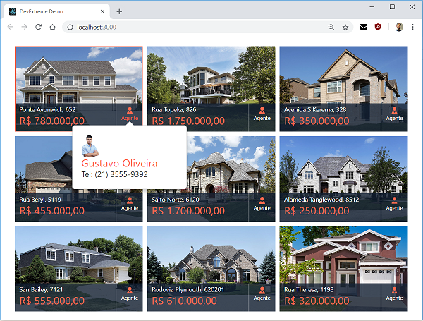
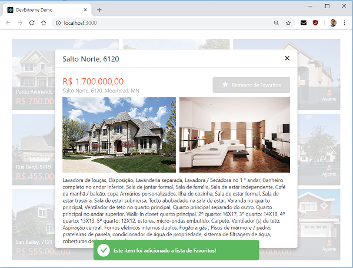
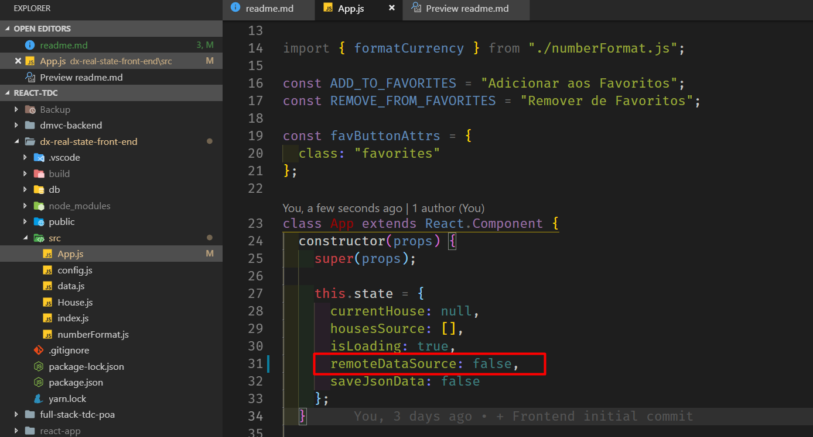

# Full stack Delphi MVC Framework and React.js DevExtreme Project

## [Clique aqui para instruções em Português](leiame)

Project source files from my TDC presentation.
The Developer Conference 2018 - Brazil - Delphi Track

Back-end: Delphi + DMVC Framework + FireDAC + PostgreSQL
Front-end: JS ES6 + React + DevExpress DevExtreme

## Presentation Theme

Intruduction to web and cloud platform.

How to create a simple, efficient, high performance and easy to maintain back end server with Delphi MVC Framework.

How to create web front end quickly with the React.js library, to consume the back end created with Delphi MVC Framework.

* Introduction to Web and Cloud Platform 
* RESTful Server with DMVC Framework and FireDAC
* Introduction to JavaScript frontend Development with React.js

## Project Demo

* Front-end built with DevExpress DevExtreme, code, data and imagens from existing example:
    https://js.devexpress.com/Demos/WidgetsGallery/Demo/Common/DialogsAndNotificationsOverview/React/Light

## Instructions

### Clone repository

* git clone https://github.com/cesarliws/full-stack-tdc-poa.git

### Restore Database backup - PostgreSQL

* dmvc-backend\db\dmvc-backend-db.backup

### Install Delphi MVC Framework

* https://danieleteti.gitbooks.io/delphimvcframework/content/chapter_getting_started.html
* Compile and run the project "dmvc-backend\ReadStateBackEnd.dproj" with Delphi

### Front end

* Install Node.js
  * https://nodejs.org/en/download/

* cd full-stack-tdc-poa\dx-real-state-front-end

#### npm

* Install project dependencies
  * npm install

* Run front end
  * npm start

or:

#### yarn

* Install yarn
  * npm install yarn

* Install project dependencies
  * yarn

* Run front end
  * yarn run start

### Run only front end

* Edit "dx-real-state-front-end\src\App.js"
* Change remoteDataSource to false inside constructor.

